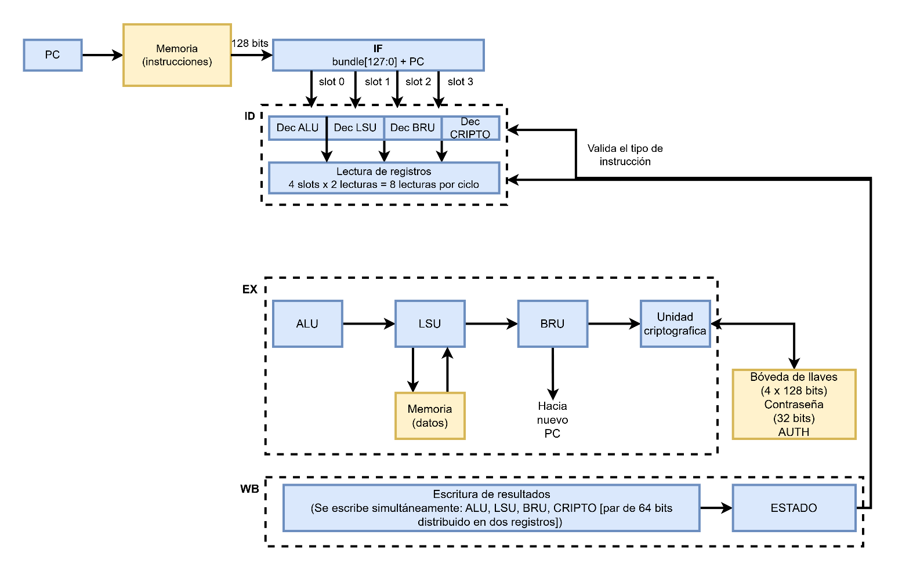

<div align="center">

**Instituto Tecnológico de Costa Rica**<br>
**Escuela de Ingeniería en Computadores**

CE4301 – Arquitectura de Computadores I

# Avance 2 ISA

**Profesor:**<br>
Dr.-Ing. Jeferson González Gómez

**Estudiantes:**<br>
Dylan Guerrero González – 2022016016<br>
José García Izaguirre – 2022437991<br>
Javier Hernández Castillo – 2022321746<br>
Alejandro Vásquez Oviedo - 2019047658<br>
Fabricio Mena Mejia – 2019042722

**Fecha de Entrega:**<br>
18 de setiembre

**II Semestre, 2026**

</div>

---

## Contenido

- [Avance 2 ISA](#avance-2-isa)
  - [Contenido](#contenido)
  - [Justificación General](#justificación-general)
    - [Convención de comparaciones y de signo (aplica a todo el ISA)](#convención-de-comparaciones-y-de-signo-aplica-a-todo-el-isa)
      - [Justificación de la convención](#justificación-de-la-convención)
  - [Instrucciones tipo almacenar](#instrucciones-tipo-almacenar)
    - [Explicación de las instrucciones](#explicación-de-las-instrucciones)
    - [Justificación de diseño](#justificación-de-diseño)
  - [Instrucciones tipo inmediato](#instrucciones-tipo-inmediato)
    - [Explicación de las instrucciones](#explicación-de-las-instrucciones-1)
    - [Justificación de diseño](#justificación-de-diseño-1)
  - [Instrucciones tipo salto](#instrucciones-tipo-salto)
    - [Explicación de las instrucciones](#explicación-de-las-instrucciones-2)
      - [Tamaño máximo del salto](#tamaño-máximo-del-salto)
    - [Justificación de diseño](#justificación-de-diseño-2)
  - [Instrucciones tipo cripto](#instrucciones-tipo-cripto)
    - [Política de autenticación y control de acceso](#política-de-autenticación-y-control-de-acceso)
      - [Restricción de uso por instrucción](#restricción-de-uso-por-instrucción)
      - [Flujo de autenticación típico](#flujo-de-autenticación-típico)
    - [Justificación](#justificación)
    - [Explicación de las instrucciones](#explicación-de-las-instrucciones-3)
      - [`fsl`](#fsl)
      - [`fsli`](#fsli)
      - [`ell`](#ell)
      - [`vcr`](#vcr)
      - [`camcon`](#camcon)
      - [`setpwd`](#setpwd)
  - [Instrucciones tipo control](#instrucciones-tipo-control)
    - [Justificación](#justificación-1)
    - [Estrategia frente a saltos](#estrategia-frente-a-saltos)
      - [Justificación de la elección](#justificación-de-la-elección)
    - [Explicación de las instrucciones](#explicación-de-las-instrucciones-4)
      - [Instrucción `igualsi`:](#instrucción-igualsi)
      - [Instrucción `igualno`:](#instrucción-igualno)
      - [Instrucción menora:](#instrucción-menora)
      - [Instrucción `mayoroigual`](#instrucción-mayoroigual)
  - [Instrucciones tipo Registro](#instrucciones-tipo-registro)
    - [Explicación de las instrucciones](#explicación-de-las-instrucciones-5)
    - [Justificación](#justificación-2)
  - [Pseudoinstrucciones:](#pseudoinstrucciones)
  - [Registros de propósito general](#registros-de-propósito-general)
  - [Resumen de la arquitectura](#resumen-de-la-arquitectura)
  - [Diagrama de organización de la arquitectura](#diagrama-de-organización-de-la-arquitectura)
  - [Green card del ISA](#green-card-de-la-isa-del-proyecto-vliw)

---

## Justificación General

Se estableció una longitud fija de **32 bits para las instrucciones**, buscando mantener una codificación uniforme en toda la arquitectura. Esta decisión permite que el procesador pueda identificar y procesar cada instrucción utilizando un formato de tamaño constante, independientemente de la unidad funcional que la ejecute.

Como estructura general, las instrucciones utilizan un prefijo compuesto por un **Tipo de operación de 7 bits** y un **ID de operación de 4 bits**. El campo de tipo permite identificar la categoría de la instrucción y asociarla con la unidad funcional correspondiente, mientras que el ID permite seleccionar la operación específica dentro de dicha categoría.

Los campos destinados a registros utilizan **5 bits**, permitiendo identificar hasta 32 registros diferentes. Aunque la arquitectura requiere como mínimo 15 registros de propósito general, se optó por un banco de registros mayor para proporcionar mayor flexibilidad al software.

Los bits restantes de cada formato se asignan de acuerdo con los operandos y parámetros requeridos por cada unidad funcional. Por esta razón, **no todos los tipos de instrucción utilizan exactamente los mismos campos.**

### Convención de comparaciones y de signo (aplica a todo el ISA)

Todos los valores que las instrucciones de esta arquitectura comparan se interpretan como enteros de 32 bits con signo, en representación de complemento a dos. La convención es única para todo el ISA y se define aquí una sola vez; las secciones de cada tipo de instrucción no vuelven a fijarla, solamente la aplican. Cubre las instrucciones de control de flujo que comparan dos registros (menora y mayoroigual), las instrucciones de tipo registro que producen un resultado booleano (mrq y myq) y el corrimiento aritmético derecho (caderi), que replica el bit de signo en lugar de rellenar con ceros.

Los inmediatos y los offsets de 11 y 16 bits también se interpretan con signo y se extienden con signo a 32 bits antes de operar. Quedan fuera de la convención, por ser magnitudes sin signo por construcción, únicamente los campos que indican una cantidad de posiciones de desplazamiento, los índices de llave (LK), de ronda (RK) y de palabra (off) de las instrucciones criptográficas, y los campos de dirección absoluta de 16 bits de esas mismas instrucciones (por ejemplo dir_cand de vcr), que cubren el rango 0–65535 de la memoria.

#### Justificación de la convención

a) El complemento a dos es la única representación de enteros que utiliza la arquitectura: la resta, el corrimiento aritmético derecho, el offset de sye y la pseudoinstrucción not rg, rf1 (que se expande a xori rg, rf1, -1 y sólo produce 0xFFFFFFFF si el inmediato se extiende con signo) ya la asumen. Una convención única evita duplicar cada comparación en dos variantes y ahorra códigos de ID.

b) La memoria del sistema es de 64 KB, de modo que toda dirección válida está en el rango 0x00000000–0x0000FFFF y resulta positiva al interpretarse con signo. Comparar punteros, índices y contadores de lazo con las instrucciones con signo entrega el resultado correcto en todos los casos que la arquitectura puede presentar, por lo que no se requieren variantes sin signo.

c) La decisión no cierra la puerta a una extensión futura: los tipos control y registro conservan códigos de ID libres, de manera que agregar variantes sin signo (por ejemplo menorau y mayoroigualu) no obligaría a cambiar el formato de los slots ni el ancho de ningún campo. Cualquier adición de ese tipo posterior a la Entrega 1 se comunicaría formalmente al grupo del compilador.

## Instrucciones tipo almacenar

| [31:25] | [24:21] | [20:16] | [15:11] | [10:0] |
|:---:|:---:|:---:|:---:|:---:|
| **Tipo de operación** | **ID operación** | **rf1** | **rf2** | **offset** |
| 7 bits | 4 bits | 5 bits | 5 bits | 11 bits |

La distribución de los campos es la siguiente:

- Tipo de operación: 7 bits.
- ID operación: 4 bits para identificar la operación específica.
- rf1: 5 bits para identificar el registro fuente.
- offset: 11 bits para representar el valor del offset que se le va a aplicar a la dirección de memoria.

| Tipo de operación | ID operación | Instrucción | Operación |
|:---:|:---:|:---:|:---:|
| 1001001 | 0000 | `guardap` | M(rf1+offset) = rf2 [31:0] |
| 1001001 | 0001 | `guardab` | M(rf1+offset) = rf2 [7:0] |
| 1001001 | 1000 | `cargai` | rg = Memoria[rf1 + inmediato] |
| 1001001 | 1001 | `cargabai` | rg = Memoria8[rf1 + inmediato] |

### Explicación de las instrucciones

La instrucción `guardap` toma una palabra (32 bits) y la guarda en la dirección de memoria que se calcula como la suma de la dirección almacenada en el registro fuente 1 (rf1) y el inmediato que se pasa a la instrucción.

Ejemplo en ensamblador:

```
guardap x3, x8, 5
```

realiza lo siguiente: suponiendo que en `x3` la dirección guardada sea `0x20` entonces toma `0x20`, le suma 5 y en `0x25` guarda el dato que se encuentra en `x8`.

Para `guardab` el proceso es el mismo solo que en este caso se guarda un byte (8 bits) en lugar de una palabra completa de 32 bits.

La instrucción `cargai` permite cargar un dato almacenado en memoria hacia un registro.

```
rg = Memoria[rf1 + inmediato]
```

Por ejemplo:

rf1 con la dirección 1000 y el valor inmediato es 20, la dirección: 1000+20 = 1020

Si la posición de memoria 1020 contiene el valor de 55, después ejecutar la instrucción el registro `rg` tendrá: rg55

Esta instrucción permite acceder a datos almacenados en memoria.

La instrucción `cargabai` funciona de manera similar a `cargai`, pero en lugar de cargar un dato completo, únicamente un byte desde la memoria. La dirección se calcula sumando el registro fuente con el inmediato. La operación realizada es:

```
rg = Memoria[rf1 + inmediato]
```

Por ejemplo:

Si rf1 tiene la dirección 2000 y el inmediato es 4, la dirección de lectura será: 2000+4=2004.

Si en la dirección 2004 se encuentra almacenado el byte 0x7F, entonces el registro destino tendrá:

rg = 0x7F

La instrucción se utiliza cuando se necesita trabajar con datos almacenados en memoria que tienen un tamaño de un byte.

### Justificación de diseño

Se decidió que la palabra fuera de 32 bits para que mantenga coherencia con la estructura general de la arquitectura. Los 5 bits para la identificación de los registros permiten acceder a los 17 registros de propósito general disponibles. Los 3 bits para identificar la operación dentro del tipo se mantienen a pesar de que este tipo concreto de instrucciones pueda operar con solo 2 bits, de esta forma los campos de tipo e ID se mantienen constantes en todos los tipos de operaciones soportadas. El offset ocupa 11 bits, esta cantidad asegura que se puedan alcanzar rangos extensos en la memoria sin preocupaciones.

## Instrucciones tipo inmediato

Formato:

| [31:25] | [24:21] | [20:16] | [15:11] | [10:0] |
|:---:|:---:|:---:|:---:|:---:|
| **Tipo de operación** | **ID operación** | **rf1** | **rg** | **Inmediato** |
| 7 bits | 4 bits | 5 bits | 5 bits | 11 bits |

La distribución de los campos es la siguiente:

- Tipo de operación: 7 bits.
- ID operación: 4 bits para identificar la operación específica.
- rf1: 5 bits para identificar el registro fuente.
- rg: 5 bits para identificar el registro destino.
- Inmediato: 11 bits para representar el valor inmediato.

Instrucciones:

| Tipo de operación | ID operºación | Instrucción | Operación |
|:---:|:---:|:---|:---|
| 1000000 | 0000 | `sumai` | rg = rf1 + inmediato |
| 1000000 | 0001 | `restai` | rg = rf1 - inmediato |
| 1000000 | 0010 | `cizqi` | rg = rf1 << inmediato |
| 1000000 | 0011 | `cderi` | rg = rf1 >> inmediato |
| 1000000 | 0100 | `caderi` | Corrimiento aritmético derecho |
| 1000000 | 0101 | `xori` | rg = rf1 XOR inmediato |
| 1000000 | 0110 | `andi` | rg = rf1 AND inmediato |
| 1000000 | 0111 | `ori` | rg = rf1 OR inmediato |

### Explicación de las instrucciones

La instrucción `sumai` realiza una suma entre el valor almacenado en un registro fuente (`rf1`) y un valor constante denominado inmediato. El resultado de esta operación se almacena en el registro destino (`rg`), sin modificar el valor original fuente.

Por ejemplo:

```
rg = rf1 + inmediato
```

El registro `rf1` contiene el valor 10 y el valor inmediato es 5, al ejecutar la instrucción `sumai` se realiza la operación:

```
rg = 10 +5
```

La instrucción `restai` realiza una resta entre el valor almacenado en un registro fuente `rf1` y un valor constante inmediato, este se almacena en el registro destino (`rg`)

Ejemplo:

```
rg + rf1 – inmediato

rg = 10 – 3
```

La instrucción `cizqi` realiza un corrimiento de bits hacia la izquierda del valor almacenado en el registro fuente rf1 una cantidad de posiciones indicada por el valor inmediato.

Ejemplo:

```
rg = rf1 << inmediato
00000101 << 2 = 00010100
```

Entonces el registro rg almacenará el valor 20 en decimal, la operación es equivalente a multiplicar el valor por una potencia de dos cuando no ocurre pérdida de bits.

La instrucción `cderi` realiza un corrimiento de bits hacia la derecha del valor almacenado en el registro fuente `rf1` utilizando la cantidad de posiciones indicada por el valor inmediato.

Ejemplo:

```
rg = fr1 >> inmediato
00010100 >> 2 = 00000101
```

El registro rg almacenará el valor 5. Esta instrucción permite reducir el valor de un número mediante desplazamientos de bits hacia la derecha.

La instrucción `caderi` realiza un corrimiento aritmético hacia la derecha del valor almacenado en el registro fuente `rf1`.

Ejemplo:

```
rg = rf1 >>> inmediato
```

Se tiene:

```
11110000
```

Y se realiza un desplazamiento aritmético hacia la derecha de 2 posiciones:

```
11110000 >>> 2 = 11111100
```

El registro rg almacenará el nuevo valor conservando el signo original

La instrucción `xori` realiza una operación lógica `xor` entre el valor almacenado en el registro `rf1` y un valor inmediato.

La operación es `rf1 xor inmediato`

Por ejemplo:

```
rf1 = 1010
inmediato: 1100
```

Por ejemplo:

```
La operación 1010 xor 1100 = 0110
```

La instrucción `andi` realiza una operación lógica `and` entre el contenido del registro fuente rf1 y un valor inmediato.

```
rg = rf1 and inmediato
```

Por ejemplo:

```
rf1 = 1010
inmediato = 1100
```

Por ejemplo:

```
1010 and 1100 = 1000
```

El registro rg almacenará 1000

Ejemplo:

1010 or 1100 = 1110

La instrucción `ori` realiza una operación lógica `or` entre el valor almacenado en el registro fuente rf1 y un valor inmediato.

```
rg = rf1 or inmediato
```

Por ejemplo:

```
rf1 = 1010 e inmediato = 1100
```

El registro rg almacenará 1110

### Justificación de diseño

Se eligió este diseño porque permite mantener las instrucciones en 32 bits y aprovechar el espacio de forma equilibrada entre identificación, registros e inmediato. Los campos de 5 bits permiten acceder a los 32 registros de la arquitectura, mientras que 4 bits son suficientes para distinguir las 10 operaciones definidas y dejar espacio para futuras extensiones. Los 11 bits restantes se destinan al inmediato, permitiendo ejecutar operaciones aritméticas, lógicas, desplazamientos y accesos a memoria sin requerir una segunda instrucción para cargar constantes.

## Instrucciones tipo salto

| [31:25] | [24:21] | [20:16] | [15:0] |
|:---|:---|:---|:---|
| **Tipo de operación** | **ID operación** | **Rg** | **offset** |
| 7 bits | 4 bits | 5 bits | 16 bits |

La distribución de los campos es la siguiente:

- Tipo de operación: 7 bits.
- ID operación: 4 bits para identificar la operación específica.
- rg: 5 bits para identificar el registro fuente.
- offset: 11 bits para representar el valor del offset que se le va a aplicar a la dirección de memoria.

| Tipo de operación | ID operación | Instrucción | Operación |
|:---:|:---:|:---:|:---:|
| 1001011 | 0000 | `sye` | rg=PC+4; PC=PC + offset |

### Explicación de las instrucciones

`sye` guarda en `rg` la dirección de la siguiente instrucción (PC + 4) y posteriormente modifica el PC sumándole el offset.

```
rg = PC + 4
PC = PC + offset
```

Ejemplo:

Si `PC = 1000` y `offset = 20`:

```
rg = 1000 + 4 = 1004
PC = 1000 + 20 = 1020
```

Por lo tanto, la ejecución continúa en la dirección 1020, mientras que `rg` conserva la dirección de retorno 1004.

#### Tamaño máximo del salto

Como el offset tiene 16 bits, si se interpreta como un número con signo en complemento a dos, su rango es:

$$
-2^{15} \leq \mathit{offset} \leq 2^{15} - 1
$$

$$
-32768 \leq \mathit{offset} \leq 32767
$$

Por lo tanto, el salto puede ser:

- Máximo hacia atrás: -32768
- Máximo hacia adelante: +32767

### Justificación de diseño

Tanto el campo de tipo de operación como el ID de esta se mantienen en el mismo lugar y con la misma cantidad de bits para que haya coherencia en toda la encodificación de la arquitectura. Los 5 bits de rg permiten acceder a los 17 posibles registros de uso general. El offset de 16 bits permite que el salto que se pueda dar sea lo más extenso posible.

La estrategia frente a saltos que aplica a sye es la misma que rige para los saltos condicionales: vaciado de pipeline sin delay slots, con una penalización de 2 ciclos cuando el salto se toma. Se define y se justifica en la sección Instrucciones tipo control, apartado [Estrategia frente a saltos](#estrategia-frente-a-saltos).

## Instrucciones tipo cripto

### Política de autenticación y control de acceso

El procesador mantiene un **registro de estado `ESTADO`** de 32 bits. De ellos, sólo el bit menos significativo (`ESTADO[0]`, en adelante "bit AUTH") define si el procesador se encuentra autenticado frente a la bóveda de llaves:

| Bit | Nombre | Significado |
|:---|:---|:---|
| `ESTADO[0]` | AUTH | `1` = autenticado, `0` = no autenticado. |
| `ESTADO[31:1]` | — | Reservados (siempre `0`). |

El bit AUTH **no es accesible** mediante instrucciones de carga/almacenamiento a memoria ni mediante lectura a registros de propósito general; sólo puede ser alterado por las instrucciones privilegiadas de la unidad criptográfica que se describen más adelante. Esto refuerza el aislamiento de la bóveda (Sección 4.4.1).

#### Restricción de uso por instrucción

| Instrucción | ¿Requiere `AUTH = 1`? | Si falta AUTH |
|:---|:---:|:---|
| `vcr` | No (es la vía de autenticación) | n/a |
| `setpwd` | **Requiere `AUTH = 0`** (sólo en arranque, antes de autenticar) | Excepción |
| `ell` | Sí | Excepción (sin escribir en bóveda) |
| `camcom` | Sí | Excepción (sin rotar la contraseña) |
| `fsl`, `fsli` | Sí | Excepción (sin consumir subllave) |

Cualquier intento de ejecutar una instrucción que requiera autenticación sin tener `AUTH = 1` genera una **excepción de privilegio** (trap de seguridad). La excepción detiene la ejecución del bundle actual y transfiere el control a una dirección de manejo a definir en la microarquitectura.

#### Flujo de autenticación típico

1. **Arranque:** el procesador parte con `AUTH = 0`. El código de boot puede invocar `setpwd` una sola vez para cargar la contraseña maestra en la bóveda desde un registro (típicamente `x16`).
2. **Validación:** `vcr` compara la contraseña candidata en memoria contra la real de la bóveda. Si coinciden, pone `AUTH = 1`; si no, mantiene `AUTH = 0`. El resultado se actualiza únicamente en `ESTADO[0]`, **no** se escribe a memoria ni a registros.
3. **Uso:** una vez autenticado, el programa puede invocar `ell`, `camcom`, `fsl` y `fsli`. Cualquier intento de bypass produce excepción.
4. **Bloqueo:** si se desea revocar el acceso, basta con sobrescribir manualmente el bit `AUTH = 0` mediante una futura instrucción de logout (a definir en extensión).

Esta política garantiza que las subllaves nunca abandonen la bóveda por buses de propósito general y que sólo código autenticado puede consumirlas.


| [31:25] | [24:21] | [20:19] | [18:17] | [16:12] | [11:7] | [6:0] |
|:---:|:---:|:---:|:---:|:---:|:---:|:---:|
| **Tipo de operación** | **ID operación** | **LK** | **RK** | **rd** | **r1** | **RSV** |
| 7 bits | 4 bits | 2 bits | 2 bits | 5 bits | 5 bits | 7 bits |

La distribución de los campos es la siguiente:

- Tipo de operación: 7 bits.
- ID operación: 4 bits para identificar la operación específica.
- LK: 2 bits para identificar el índice de la llave en la bóveda (0–3).
- RK: 2 bits para identificar el índice de la ronda/subllave dentro de la llave (0–3).
- rd: 5 bits para identificar el registro destino del par de salida (L_out, R_out).
- r1: 5 bits para identificar el registro fuente del par de entrada (L_in, R_in).
- RSV: 7 bits reservados.

| Tipo de operación | ID operación | Instrucción | Operación |
|:---:|:---:|:---|:---|
| 0000010 | 0000 | `fsl` | (L_out, R_out) = feistel_round((L_in, R_in), LK, RK) |
| 0000010 | 0001 | `fsli` | (L_out, R_out) = feistel_round_inv((L_in, R_in), LK, RK) |
| 0000010 | 0010 | `ell` | bóveda[LK][off..off+1] = (rs1, rs2) |
| 0000010 | 0011 | `vcr` | actualiza ESTADO con (mem[dir_cand] == mem[dir_real]) |
| 0000010 | 0100 | `camcom` | mem[dir] = ROL(mem[dir], imm) |
| 0000010 | 0101 | `setpwd` | dir_contraseña_real = rf (solo en arranque, sin autenticar) |
| 0000010 | 0110–1111 | — | reservados |

### Justificación

El formato de las instrucciones cripto hereda del prefijo común del ISA (tipo 7 bits + ID operación 4 bits), dejando 21 bits para operandos. Esto mantiene coherencia con los demás tipos. Simplifica el decode del bundle y permite que el dispatcher identifique la FU cripto mirando únicamente el campo tipo.

Para `fsl` y `fsli` se eligió ejecutar una ronda por instrucción, no las cuatro juntas, para exponer paralelismo entre slots del bundle. El direccionamiento de la subllave se divide en `lk` (2 bits, índice de llave) y `rk` (2 bits, índice de subllave o ronda), porque 2 bits permiten indexar 4 elementos y facilita la legibilidad que un solo campo de 4 bits. Los registros `rd` y `rf1` apuntan a pares adyacentes (L, R) por convención, ahorrando 10 bits respecto a codificar los cuatro operandos por separado.

`ell` se eligió escribir 64 bits por invocación, dos palabras con rs1 y rs2, en lugar de 32 bits. Esto reduce el número de instrucciones necesarias para cargar una llave completa de 4 a 2, sin superar los 21 bits disponibles.

`vcr`, la validación de credenciales, compara la contraseña candidata (en memoria) directamente contra la contraseña real residente en la bóveda, **sin** pasar la contraseña real por buses de propósito general ni por registros: el dato sensible nunca abandona el hardware de la cripto FU. El resultado de la comparación sólo se refleja en el bit `AUTH` interno (`ESTADO[0]`), sin escribir a memoria de propósito general.

`camcom`, el cambio de contraseña recibe un inmediato de n bits con la cantidad de corrimientos a aplicar sobre la contraseña actual. Codificarlo como inmediato es práctico para una rotación lógica circular.

**Nota de aislamiento:** las subllaves únicamente salen de la bóveda de manera implícita al ejecutarse `fsl`/`fsli`; no existen instrucciones que copien contenido de la bóveda a registros de propósito general ni a memoria. 
### Explicación de las instrucciones

#### `fsl`

Descripción: Ejecuta una ronda directa de Feistel. Lee el par (L, R) desde los registros fuente, lee la subllave correspondiente de la bóveda y escribe el par cifrado en los registros destino.

Formato:

| 31:25 | 24:21 | 20:19 | 18:17 | 16:12 | 11:7 | 6:0 |
|:---:|:---:|:---:|:---:|:---:|:---:|:---:|
| **Tipo** | **ID** | **LK** | **RK** | **rd** | **r1** | **RSV** |
| 7 bits | 4 bits | 2 bits | 2 bits | 5 bits | 5 bits | 7 bits |

Descripción de campos:

| Campo | Bits | Significado |
|:---|:---|:---|
| Tipo | [31:25] | 0000010 — identifica la UF Cripto |
| ID | [24:21] | 0000 — opcode de FSL |
| LK | [20:19] | Índice de llave en la bóveda (0–3) |
| RK | [18:17] | Índice de subllave dentro de la llave (0–3) |
| rg | [16:12] | Registro destino L_out; R_out se escribe en rd+1 |
| rf1 | [11:7] | Registro fuente L_in; R_in se lee de r1+1 |
| RSV | [6:0] | 0000000 — reservados para extensión futura |

Ejemplo en ensamblador:

```
fsl rd=6, r1=2, LK=0, RK=1
```

Restricciones:

- Requiere `ESTADO[0] = AUTH = 1`; en caso contrario genera **excepción de privilegio**.
- `rg` y `rf1` deben estar en registros pared a partir de `x2` (registros de la cripto FU).
- `LK` ∈ {0,1,2,3} y `RK` ∈ {0,1,2,3}.
- La subllave se lee internamente de la bóveda; nunca abandona la bóveda.

#### `fsli`

Descripción: Ejecuta una ronda inversa de Feistel. Igual que `fsl` pero aplicando las subllaves en orden inverso. Se usa para descifrar.

Formato:

| 31:25 | 24:21 | 20:19 | 18:17 | 16:12 | 11:7 | 6:0 |
|:---:|:---:|:---:|:---:|:---:|:---:|:---:|
| **Tipo** | **ID** | **LK** | **RK** | **rd** | **r1** | **RSV** |
| 7 bits | 4 bits | 2 bits | 2 bits | 5 bits | 5 bits | 7 bits |

Descripción de campos:

| Campo | Bits | Significado |
|:---|:---|:---|
| Tipo | [31:25] | 0000010 |
| ID | [24:21] | 0001 — opcode de FSLI |
| LK | [20:19] | Índice de llave en la bóveda (0–3) |
| RK | [18:17] | Índice de subllave dentro de la llave (0–3) |
| rg | [16:12] | Registro destino L_out; R_out se escribe en rd+1 |
| rf1 | [11:7] | Registro fuente L_in; R_in se lee de r1+1 |
| RSV | [6:0] | 0000000 |

Ejemplo en ensamblador:

```
fsli  rd=6, r1=2, LK=0, RK=3
```

Restricciones:

- Requiere `ESTADO[0] = AUTH = 1`; en caso contrario genera **excepción de privilegio**.
- `rg` y `rf1` deben estar en registros pares.
- `LK` ∈ {0,1,2,3} y RK ∈ {0,1,2,3}.

#### `ell`

Descripción: Escribe 64 bits (dos palabras de 32 bits) desde dos registros fuente hacia la bóveda de llaves. Permite cargar una llave completa de 128 bits con 2 invocaciones.

Formato:

| 31:25 | 24:21 | 20:19 | 18:17 | 16:12 | 11:7 | 6:0 |
|:---:|:---:|:---:|:---:|:---:|:---:|:---:|
| **Tipo** | **ID** | **LK** | **off** | **rs1** | **rs2** | **RSV** |
| 7 bits | 4 bits | 2 bits | 2 bits | 5 bits | 5 bits | 7 bits |

Descripción de campos:

| Campo | Bits | Significado |
|:---|:---|:---|
| Tipo | [31:25] | 0000010 |
| ID | [24:21] | 0010 — opcode de ELL |
| LK | [20:19] | Índice de llave destino en la bóveda (0–3) |
| off | [18:17] | Offset dentro de la llave (0 = MSW, 3 = LSW) |
| rf1 | [16:12] | Registro fuente → vault[LK][off] |
| rf2 | [11:7] | Registro fuente → vault[LK][off+1] |
| RSV | [6:0] | 0000000 |

Ejemplo en ensamblador:

```
# Cargar la llave 2 con cuatro palabras desde x4, x6, x8, x10
ell    LK=2, off=0, rs1=4, rs2=6
ell    LK=2, off=2, rs1=8, rs2=10
```

Restricciones:

- Requiere `ESTADO[0] = AUTH = 1`; en caso contrario genera **excepción de privilegio**.
- `rf1` y `rf2` pueden ser cualquier registro par.
- `LK` ∈ {0,1,2,3} y `off` ∈ {0,2} para no desbordar la llave.

#### `vcr`

Descripción: Compara la contraseña candidata contra la contraseña real y actualiza el bit `AUTH` del registro `ESTADO` en consecuencia: `AUTH = 1` si coinciden, `AUTH = 0` en caso contrario. El resultado nunca se escribe a memoria de propósito general ni a registros; sólo modifica el bit interno `ESTADO[0]`.

Formato:

| 31:25 | 24:21 | 20:5 | 4:0 |
|:---:|:---:|:---:|:---:|
| **Tipo** | **ID** | **dir_cand** | **RSV** |
| 7 bits | 4 bits | 16 bits | 5 bits |

Descripción de campos:

| Campo | Bits | Significado |
|:---|:---|:---|
| Tipo | [31:25] | 0000010 |
| ID | [24:21] | 0011 — opcode de VCR |
| dir_cand | [20:5] | Dirección de memoria de la contraseña candidata (0–65535) |
| RSV | [4:0] | 00000 — reservados |
| contraseña real | — | implícita en la bóveda |

Ejemplo en ensamblador:

```
# Validar contraseña candidata en mem[0x2000]
# contra la real guardada en la bóveda
vcr    dir_cand=0x2000
```

Restricciones:

- `vcr` se puede invocar siempre, esté o no autenticado el procesador: es la única vía de autenticación.
- `dir_cand` ∈ [0, 65535] (cubre toda la memoria de 64 KB).

#### `camcon`

Descripción: Renueva la contraseña actual aplicando una rotación lógica circular a la izquierda. Requiere que el procesador esté autenticado.

Formato:

| 31:25 | 24:21 | 20:5 | 4:0 |
|:---:|:---:|:---:|:---:|
| **Tipo** | **ID** | **dir** | **imm** |
| 7 bits | 4 bits | 16 bits | 5 bits |

Descripción de campos:

| Campo | Bits | Significado |
|:---|:---|:---|
| Tipo | [31:25] | 0000010 |
| ID | [24:21] | 0100 — opcode de CAMCON |
| dir | [20:5] | Dirección de memoria de la contraseña actual (0–65535) |
| imm | [4:0] | Cantidad de corrimientos a la izquierda (0–31) |

Ejemplo en ensamblador:

```
# Renovar la contraseña en mem[0x0010] rotándola 7 bits
camcon   dir=0x0010, imm=7
```

Restricciones:

- Requiere `ESTADO[0] = AUTH = 1`; en caso contrario genera **excepción de privilegio**.
- `imm` ∈ [0, 31].

#### `setpwd`

Descripción: Inicializa la contraseña en la bóveda desde un registro fuente al arrancar el sistema. Es la única vía para depositar la contraseña maestra.

Formato:

| 31:25 | 24:21 | 20:5 | 4:0 |
|:---:|:---:|:---:|:---:|
| **Tipo** | **ID** | **dir** | **rs** |
| 7 bits | 4 bits | 16 bits | 5 bits |

Descripción de campos:

| Campo | Bits | Significado |
|:---|:---|:---|
| Tipo | [31:25] | 0000010 |
| ID | [24:21] | 0111 — opcode de SETPWD |
| dir | [20:5] | Dirección de memoria destino (0–65535) |
| rf | [4:0] | Registro fuente con la contraseña inicial (32 bits) |

Ejemplo en ensamblador:

```
# Inicializar contraseña: x5 → mem[0x0010]
setpwd   rs=5, dir=0x0010
movi     x16, 0x0010
```

Restricciones:

- Sólo se permite cuando `ESTADO[0] = AUTH = 0` (camino de inicialización en arranque). Si el procesador ya está autenticado genera **excepción de privilegio**.
- El campo `rf` se ignora a nivel arquitectónico; el valor se toma del registro `x16` por convención para reforzar el aislamiento.

## Instrucciones tipo control

| [31:25] | [24:21] | [20:16] | [15:11] | [10:0] |
|:---:|:---:|:---:|:---:|:---:|
| **Tipo de operación** | **ID operación** | **rf1** | **rf2** | **Inmediato** |
| 7 bits | 4 bits | 5 bits | 5 bits | 11 bits |

La distribución de los campos es la siguiente:

- Tipo de operación: 7 bits.
- ID operación: 4 bits para identificar la operación específica.
- rf1: 5 bits para identificar el registro fuente.
- rf2: 5 bits para identificar el registro con el que se compara rf1.
- Inmediato: 11 bits para representar el valor inmediato.

**Instrucciones:**

| Tipo de operación | ID operación | Instrucción | Operación |
|:---:|:---:|:---|:---|
| 1000001 | 0001 | `igualsi` | if (rf1 == rf2) PC += inmediato |
| 1000001 | 0010 | `igualno` | if (rf1 != rf2) PC += inmediato |
| 1000001 | 0100 | `menora` | if (rf1 < rf2) PC += inmediato (con signo) |
| 1000001 | 1000 | `mayoroigual` | if (rf1 >= rf2) PC += inmediato (con signo) |

### Justificación

Las instrucciones de control se diseñaron utilizando un formato de 32 bits, manteniendo la estructura general de la ISA. Se conservaron los 7 bits correspondientes al tipo de operación y los 4 bits del ID de operación, permitiendo identificar la unidad de control de flujo y diferenciar las distintas condiciones de salto.

Para las instrucciones de salto condicional se utilizan dos registros fuente de 5 bits (`rf1` y `rf2`), ya que las operaciones definidas requieren comparar directamente dos registros. Con 5 bits es posible identificar cualquiera de los registros disponibles en el banco de registros de la arquitectura, manteniendo la compatibilidad con los demás formatos.

Los 11 bits restantes se destinan al inmediato utilizado como `offset` del salto. Este valor se interpreta como un desplazamiento respecto al valor actual del Program Counter (PC), permitiendo modificar el flujo de ejecución sin necesidad de almacenar una dirección absoluta dentro de la instrucción.

Se definieron cuatro operaciones de salto condicional: `igualsi`, `igualno`, `menora` y `mayoroigual`. Estas permiten cubrir las comparaciones fundamentales entre dos registros y proporcionan las operaciones necesarias para implementar estructuras de decisión y repetición en programas de propósito general.

### Estrategia frente a saltos

**Política adoptada: vaciado de pipeline (flush) sin ranuras de retardo (delay slots).**

Toda instrucción de salto de la arquitectura — los saltos condicionales igualsi, igualno, menora y mayoroigual, y el salto incondicional sye del tipo salto — se evalúa en la etapa EX del pipeline, que es donde la unidad BRU calcula la condición y la dirección destino. Cuando el salto se toma, los bundles que ya ingresaron al pipeline detrás de él, es decir los que en ese ciclo ocupan las etapas IF e ID (2 bundles en la organización de cuatro etapas presentada en la sección [Diagrama de organización de la arquitectura](#diagrama-de-organización-de-la-arquitectura)), se anulan: no escriben el banco de registros, ni la memoria, ni la bóveda de llaves, ni el registro ESTADO. El siguiente bundle que se ejecuta es el de la dirección destino.

La arquitectura no define delay slots: el bundle inmediatamente posterior a un salto tomado nunca se ejecuta. Quien genera el código, sea el ensamblador propio o el compilador del grupo de contraparte, no debe rellenar ninguna ranura de retardo después de un salto ni insertar NOPs por causa de él.

Penalización. Un salto tomado cuesta 2 ciclos de vaciado; un salto no tomado no tiene penalización alguna y la ejecución continúa con el bundle siguiente. La penalización queda declarada explícitamente en este documento, por lo que no constituye una penalización oculta.

Efecto sobre el estado del procesador. Un bundle anulado no produce ningún efecto colateral: si contenía una operación criptográfica, ésta no consume subllaves de la bóveda, ni altera el estado de autenticación, ni genera la [excepción de privilegio](#política-de-autenticación-y-control-de-acceso); si contenía un acceso a memoria, la lectura o escritura no se realiza.

#### Justificación de la elección

1. Independencia del ISA respecto de la microarquitectura. La cantidad de delay slots depende del número de etapas y de en cuál de ellas se resuelve el salto. Fijarlos desde ahora ataría el contrato del ISA a un detalle de organización que aún no ha sido diseñada. Con vaciado, si la organización cambia — por ejemplo al separar el acceso a memoria en una etapa adicional — el ISA congelado sigue siendo válido y lo único que varía es el número de ciclos de penalización. Con delay slots, ese mismo cambio invalidaría todo el código ya generado.

2. Contrato más simple con el grupo del compilador. El compilador ya asume toda la calendarización estática de los cuatro slots y el manejo de las dependencias de datos, porque el hardware no las resuelve. Obligarlo además a llenar ranuras de retardo aumentaría la complejidad del generador de código sin un beneficio proporcional.

3. Un delay slot es especialmente caro en una arquitectura VLIW. La ranura de retardo no sería una instrucción sino un bundle completo de 128 bits con sus cuatro slots. Encontrar trabajo útil e independiente para los cuatro slots después de cada salto es poco probable, de modo que en la práctica se rellenarían con NOPs: se gastarían 16 bytes de memoria de instrucciones por salto para lograr el mismo efecto que el vaciado consigue sin ocupar memoria.

4. El costo es asumible para la aplicación objetivo. Los lazos de cifrado tienen cuerpos de decenas de bundles, ya que cada bloque requiere cuatro rondas Feistel4 más las cargas y los almacenamientos correspondientes, por lo que 2 ciclos por iteración son despreciables frente al total.

5. Es compatible con la calendarización estática que exige el enunciado. El enunciado prohíbe que el hardware detecte y resuelva riesgos de datos de forma dinámica, pero el vaciado atiende un riesgo de control, no de datos: es una señal local de la unidad BRU que invalida los bundles en vuelo y no requiere forwarding, scoreboarding ni detección de dependencias entre instrucciones.

### Explicación de las instrucciones

**Formato:**

| [31:25] | [24:21] | [20:16] | [15:11] | [10:0] |
|:---|:---|:---|:---|:---|
| **Tipo** | **ID** | **rf1** | **rf2** | **Inmediato** |
| 7 bits | 4 bits | 5 bits | 5 bits | 11 bits |

**Descripción de campos:**

| Campo | Bits | Significado |
|:---|:---|:---|
| **Tipo** | [31:25] | 1000001 — identifica las instrucciones de control |
| **ID** | [24:21] | 0001 — código de la operación |
| **rf1** | [20:16] | Primer registro fuente de la comparación |
| **rf2** | [15:11] | Segundo registro fuente de la comparación |
| **Inmediato** | [10:0] | Desplazamiento relativo que se suma al PC cuando la condición se cumple |

#### Instrucción `igualsi`:

Descripción: Compara los valores almacenados en `rf1` y `rf2`. Si ambos valores son iguales, el Program Counter (PC) se modifica sumándole el valor del inmediato. Si la condición no se cumple, el flujo de ejecución continúa normalmente.

Operación:

```
if (rf1 == rf2) PC += inmediato
```

**Ejemplo en ensamblador:**

```
# Saltar con desplazamiento 4 si x3 es igual a x4
igualsi   rf1=3, rf2=4, inmediato=4
```

**Restricciones:**

- `rf1` y `rf2` pueden identificar cualquiera de los 32 registros (`x0–x31`).
- El inmediato debe codificarse utilizando los 11 bits disponibles del campo [10:0].
- La instrucción no escribe un registro de propósito general; únicamente puede modificar el flujo de ejecución.
- La condición evaluada es igualdad exacta entre los 32 bits de `rf1` y `rf2`.

#### Instrucción `igualno`:

Descripción: Compara los valores almacenados en `rf1` y `rf2`. Si los valores son diferentes, el Program Counter (PC) se modifica sumándole el valor del inmediato. Si ambos registros contienen el mismo valor, no se realiza el salto.

Operación:

```
if (rf1 != rf2) PC += inmediato
```

Ejemplo en ensamblador:

```
# Saltar con desplazamiento 6 si x5 es diferente de x6
igualno   rf1=5, rf2=6, inmediato=6
```

**Restricciones:**

- `rf1` y `rf2` pueden identificar cualquiera de los 32 registros (`x0–x31`).
- El inmediato debe codificarse utilizando los 11 bits disponibles del campo [10:0].
- La instrucción no escribe un registro de propósito general; únicamente puede modificar el flujo de ejecución.
- La condición se cumple cuando `rf1` y `rf2` contienen valores distintos.

#### Instrucción menora:

Descripción: Compara los valores contenidos en rf1 y rf2. Si el valor de rf1 es menor que el valor de rf2 (comparación con signo, en complemento a dos), el Program Counter (PC) se modifica sumándole el inmediato. En caso contrario, el salto no se realiza.

**Operación:**

```
if (rf1 < rf2) PC += inmediato — comparación con signo
```

**Ejemplo en ensamblador:**

```
# Saltar con desplazamiento 3 si x7 es menor que x8
menora    rf1=7, rf2=8, inmediato=3
```

**Restricciones:**

- rf1 y rf2 pueden identificar cualquiera de los 32 registros (x0–x31).
- El inmediato debe codificarse utilizando los 11 bits disponibles del campo [10:0].
- La instrucción no escribe un registro de propósito general; únicamente puede modificar el flujo de ejecución.
- La comparación se interpreta con signo, en complemento a dos, según la [convención de comparaciones y de signo](#convención-de-comparaciones-y-de-signo-aplica-a-todo-el-isa) definida para todo el ISA en la sección Justificación General.

#### Instrucción `mayoroigual`

Descripción: Compara los valores contenidos en `rf1` y `rf2`. Si el valor de `rf1` es mayor o igual que el valor de rf2 (comparación con signo, en complemento a dos), el Program Counter (PC) se modifica sumándole el inmediato. Si la condición es falsa, el salto no se realiza.

Operación:

```
if (rf1 >= rf2) PC += inmediato — comparación con signo
```

Ejemplo en ensamblador:

```
# Saltar con desplazamiento 5 si x9 es mayor o igual que x10
mayoroigual   rf1=9, rf2=10, inmediato=5
```

Restricciones:

- `rf1` y `rf2` pueden identificar cualquiera de los 32 registros (`x0–x31`).
- El inmediato debe codificarse utilizando los 11 bits disponibles del campo [10:0].
- La instrucción no escribe un registro de propósito general; únicamente puede modificar el flujo de ejecución.
- La comparación se interpreta con signo, en complemento a dos, según la [convención de comparaciones y de signo](#convención-de-comparaciones-y-de-signo-aplica-a-todo-el-isa) definida para todo el ISA en la sección Justificación General.

## Instrucciones tipo Registro

| [31:25] | [24:21] | [20:16] | [15:11] | [10:6] |
|:---:|:---:|:---:|:---:|:---:|
| **Tipo de operación** | **ID operación** | **rg** | **rf1** | **rf2** |
| 7 bits | 4 bits | 5 bits | 5 bits | 5 bits |

La distribución de los campos es la siguiente:

- Tipo de operación: 7 bits.
- ID operación: 4 bits para identificar la operación específica.
- rf1: 5 bits para identificar el registro fuente 1.
- rf2: 5 bits para identificar el registro fuente 2.
- rg: 5 bits para identificar el registro rg.

| Tipo de operación | ID operación | Instrucción | Operación |
|:---|:---|:---|:---|
| 1101010 | 1000 | `suma` | rg = rf1 + rf2 |
| 1101010 | 1001 | `resta` | rg = rf1 - rf2 |
| 1101010 | 1011 | `corrimiento izquierdo` | rg = rf1 << rf2 |
| 1101010 | 1111 | `corrimiento derecho` | rg = rf1 >> rf2 |
| 1101010 | 1010 | `corrimiento aritmetico derecho` | rg = rf1 >> rf2 |
| 1101010<br>1101010 | 1110 | `xor` | rg = rf1 XOR rf2 |
| 1101010 | 1100 | `and` | rg = rf1&rf2 |
| 1101010 | 1101 | `or` | rg = rf1\|rf2 |
| 1101010 | 0101 | `mrq` | rg = rf1<rf2 (con signo) |
| 1101010 | 0110 | `myq` | rg = rf1>rf2 (con signo) |

### Explicación de las instrucciones

`suma`: suma el contenido de los dos registros `rf1` y `rf2` de 32 bits y los guarda en el registro `rg`.

`resta`: resta el contenido de los dos registros `rf1` y `rf2` de 32 bits y los guarda en el registro `rg`.

Corrimiento izquierdo: desplaza los bits de `rf1` hacia la izquierda la cantidad de posiciones indicada por rf2, el resultado se almacena en rg.

Ejemplo:

```
Si rf1 = 5 (0101) y rf2 = 2:

rg = 0101 << 2 = 010100 = 20
```

Corrimiento derecho: desplaza los bits de `rf1` hacia la derecha, rellenando con ceros. La cantidad de posiciones es indicada por `rf2`.

Ejemplo:

```
Si rf1 = 20 (10100) y rf2 = 2:

rg = 10100 >> 2 = 00101 = 5
```

Corrimiento aritmetico derecho: desplaza los bits de `rf1` hacia la derecha, conservando el bit de signo. La cantidad de posiciones es indicada por `rf2`.

Ejemplo:

```
Si rf1 = -8 y rf2 = 2:

rg = -8 >>> 2 = -2
```

`xor`: realiza una operación `xor` bit a bit entre `rf1` y `rf2`, almacenando el resultado en `rg`.

Ejemplo:

```
rf1 = 1010
rf2 = 1100
      ----
rg  = 0110
```

`and`: realiza una operación `and` bit a bit entre `rf1` y `rf2`, almacenando el resultado en `rg`.

Ejemplo:

```
rf1 = 1010
rf2 = 1100
      ----
rg  = 1000

rg = 8
```

`or`: realiza una operación `or` bit a bit entre `rf1` y `rf2`, almacenando el resultado en `rg`.

Ejemplo:

```
rf1 = 1010
rf2 = 1100
      ----
rg  = 1110

rg = 14
```

`mrq`: Compara los valores de `rf1` y `rf2` y determina si `rf1` es menor que `rf2`. Ambos operandos se interpretan como enteros con signo, en complemento a dos.

```
rg = (rf1 < rf2)
```

Ejemplo:

```
Si rf1 = 5 y rf2 = 10:

rg = (5 < 10) = 1

Si la condición no se cumple, rg = 0
```

`myq`: Compara los valores de `rf1` y `rf2` y determina si `rf1` es mayor que `rf2`. Ambos operandos se interpretan como enteros con signo, en complemento a dos.

```
rg = (rf1 > rf2)
```

Ejemplo:

```
Si rf1 = 10 y rf2 = 5:

rg = (10 > 5) = 1

Si la condición no se cumple, rg = 0
```

### Justificación

La distribución de los campos se realizó tomando en cuenta la necesidad de identificar correctamente la operación y los registros involucrados dentro de una instrucción de 32 bits. Se asignaron 7 bits para el tipo de operación, ya que permite definir una cantidad suficiente de instrucciones disponibles dentro del procesador. Además, se utilizaron 4 bits para el identificador de operación, con el objetivo de diferenciar operaciones específicas que pertenecen a un mismo tipo.

Para los registros se asignaron campos de 5 bits debido a que permiten representar hasta 32 registros diferentes, lo cual brinda una cantidad adecuada de registros de propósito general. Los campos rg, rf1 y rf2 permiten identificar el registro destino y los registros fuente utilizados por la operación, facilitando la lectura y ejecución de la instrucción por parte del procesador.

## Pseudoinstrucciones:

| Pseudo | Expansión |
|:---|:---|
| `nop` | valor hexa: 0x00000000 |
| `mov rg, rf1` | suma rg, rf1, x0 |
| `not rg, rf1` | xori rg, rf1, -1 |

Las resuelve el ensamblador

## Registros de propósito general

32 registros de 32 bits, x0–x31.

| Registro | Nombre ABI | Convención |
|:---|:---|:---|
| `x0` | cero | Constante 0. Las escrituras se descartan. |
| `x1` | ra | Dirección de retorno (escrita por sye por convención). |
| `x2` | sp | Puntero de pila (crece hacia abajo). |
| `x3` | gp | Puntero global. |
| `x4–x15` | t0–t11 | Temporales (no se preservan entre llamadas). |
| `x16–x31` | s0–s15 | Preservados entre llamadas (el llamado los guarda si los usa). |

**gp**: base fija de la zona de datos (p. ej. 0x4000), inicializado una vez al arrancar. Importa porque cargai/guardap sólo tienen 11 bits de desplazamiento (±1 KB): con gp como base, cualquier dato global se alcanza en una sola instrucción (`cargai x8, gp, 16`) en vez de construir la dirección con calta + cbaja en dos bundles. Lo usan las instrucciones de carga y almacenamiento (`cargai`, `cargabai`, `guardap`, `guardab`) como registro base rf1.

## Resumen de la arquitectura

| Parámetro | Valor | Justificación breve |
|:---|:---|:---|
| Ancho de slot | 32 bits | Codificación uniforme; cabe en una palabra de memoria. |
| Slots por bundle | 4 (fijos) | Mínimo del enunciado; un slot por tipo de unidad funcional. |
| Ancho de bundle | 128 bits (16 bytes) | Potencia de 2: el PC avanza 16 bytes y el fetch lee una línea alineada. |
| Asignación de slots | Slot 0 = ALU · Slot 1 = LSU · Slot 2 = BRU · Slot 3 = CRIPTO | Esquema de slots fijos: el despacho no necesita campo de selección. |
| NOP | 0x00000000 en cualquier slot | El `TIPO = 0000000` no se usa por ninguna FU activa (ALU=1000000/1101010, LSU=1001001, BRU=1000001/1001011, Cripto=0000010), por lo que el decodificador lo reconoce como NOP en cualquier slot sin invocar ninguna unidad funcional. |
| Registros | 32 × 32 bits (x0–x31), x0 = 0 | Campos de 5 bits; x0 constante. |
| PC | 32 bits, alineado a 16 bytes | Direccionamiento por byte, bundle alineado. |
| Registro de estado | ESTADO (32 bits) | Autenticación. |
| Memoria | 64 KB mínimo, byte-direccionable, little-endian, direcciones de 32 bits | Requisito del enunciado. |
| Bóveda de llaves | 4 llaves × 128 bits (4 subllaves de 32 bits) + contraseña de 32 bits | Sólo accesible por la unidad criptográfica. |
| Calendarización | Estática. Sin forwarding, sin stalls. | Requisito del enunciado. |

## Diagrama de organización de la arquitectura



## Green card de la ISA del proyecto VLIW 

Todas las instrucciones miden 32 bits: **Tipo de operación** [31:25] (7 bits) + **ID de operación** [24:21] (4 bits) + operandos (21 bits, según el tipo). Los campos de registro usan 5 bits (x0–x31).

## Instrucciones tipo almacenar

| Mnemónico | Nombre | Descripción / ejemplo |
|---|---|---|
| `guardap` | Guardar palabra | `M(rf1+offset) = rf2[31:0]`. Ej.: `guardap x3, x8, 5` → si x3 = 0x20, guarda x8 en 0x25. |
| `guardab` | Guardar byte | `M(rf1+offset) = rf2[7:0]`. Igual que `guardap` pero solo guarda el byte menos significativo. |

## Instrucciones tipo inmediato

| Mnemónico | Nombre | Descripción / ejemplo |
|---|---|---|
| `sumai` | Suma con inmediato | `rg = rf1 + inm`. Ej.: rf1 = 10, inm = 5 → rg = 15. |
| `restai` | Resta con inmediato | `rg = rf1 - inm`. Ej.: rf1 = 10, inm = 3 → rg = 7. |
| `cizqi` | Corrimiento izquierdo inmediato | `rg = rf1 << inm`. Ej.: `00000101 << 2 = 00010100` (20). |
| `cderi` | Corrimiento derecho lógico inmediato | `rg = rf1 >> inm`, rellena con ceros. Ej.: `00010100 >> 2 = 00000101` (5). |
| `caderi` | Corrimiento aritmético derecho inmediato | `rg = rf1 >>> inm`, conserva el signo. Ej.: `11110000 >>> 2 = 11111100`. |
| `xori` | XOR con inmediato | `rg = rf1 XOR inm`. Ej.: `1010 XOR 1100 = 0110`. |
| `andi` | AND con inmediato | `rg = rf1 AND inm`. Ej.: `1010 AND 1100 = 1000`. |
| `ori` | OR con inmediato | `rg = rf1 OR inm`. Ej.: `1010 OR 1100 = 1110`. |
| `cargai` | Cargar palabra | `rg = M[rf1 + inm]`. Ej.: rf1 = 1000, inm = 20 → rg = M[1020]. |
| `cargabai` | Cargar byte | `rg = M8[rf1 + inm]`. Ej.: rf1 = 2000, inm = 4, M[2004] = 0x7F → rg = 0x7F. |

## Instrucciones tipo salto

| Mnemónico | Nombre | Descripción / ejemplo |
|---|---|---|
| `sye` | Saltar y enlazar | `rg = PC + 4; PC = PC + offset` (offset de 16 bits con signo, −32768 a 32767). Ej.: PC = 1000, offset = 20 → rg = 1004, PC = 1020. |

## Instrucciones tipo control

| Mnemónico | Nombre | Descripción / ejemplo |
|---|---|---|
| `igualsi` | Saltar si igual | `if (rf1 == rf2) PC += inm`. Ej.: `igualsi rf1=3, rf2=4, inmediato=4`. |
| `igualno` | Saltar si no es igual | `if (rf1 != rf2) PC += inm`. Ej.: `igualno rf1=5, rf2=6, inmediato=6`. |
| `menora` | Saltar si menor | `if (rf1 < rf2) PC += inm`. Ej.: `menora rf1=7, rf2=8, inmediato=3`. |
| `mayoroigual` | Saltar si mayor o igual | `if (rf1 >= rf2) PC += inm`. Ej.: `mayoroigual rf1=9, rf2=10, inmediato=5`. |

## Instrucciones tipo registro

| Mnemónico | Nombre | Descripción / ejemplo |
|---|---|---|
| `suma` | Suma | `rg = rf1 + rf2`. |
| `resta` | Resta | `rg = rf1 - rf2`. |
| `cizq` | Corrimiento izquierdo | `rg = rf1 << rf2`. Ej.: rf1 = 5, rf2 = 2 → rg = 20. |
| `cder` | Corrimiento derecho lógico | `rg = rf1 >> rf2`, rellena con ceros. Ej.: rf1 = 20, rf2 = 2 → rg = 5. |
| `cader` | Corrimiento aritmético derecho | `rg = rf1 >>> rf2`, conserva el signo. Ej.: rf1 = −8, rf2 = 2 → rg = −2. |
| `xor` | XOR | `rg = rf1 XOR rf2`. Ej.: `1010 XOR 1100 = 0110`. |
| `and` | AND | `rg = rf1 AND rf2`. Ej.: `1010 AND 1100 = 1000` (8). |
| `or` | OR | `rg = rf1 OR rf2`. Ej.: `1010 OR 1100 = 1110` (14). |
| `mrq` | Menor que | `rg = (rf1 < rf2) ? 1 : 0`. Ej.: rf1 = 5, rf2 = 10 → rg = 1. |
| `myq` | Mayor que | `rg = (rf1 > rf2) ? 1 : 0`. Ej.: rf1 = 10, rf2 = 5 → rg = 1. |

## Instrucciones tipo cripto

| Mnemónico | Nombre | Descripción / ejemplo |
|---|---|---|
| `fsl` | Ronda Feistel | `(L_out, R_out) = feistel_round((L_in, R_in), LK, RK)`; lee el par (r1, r1+1) y escribe (rd, rd+1). Ej.: `fsl rd=6, r1=2, LK=0, RK=1`. |
| `fsli` | Ronda Feistel inversa | Igual que `fsl` pero aplica las subllaves en orden inverso (descifrado). Ej.: `fsli rd=6, r1=2, LK=0, RK=3`. |
| `ell` | Escribir llave en la bóveda | `bóveda[LK][off..off+1] = (rs1, rs2)`, escribe 64 bits. Ej.: `ell LK=2, off=0, rs1=4, rs2=6` y `ell LK=2, off=2, rs1=8, rs2=10` cargan la llave completa. |
| `vcr` | Validar credenciales | `M[dir_flag] = (M[dir_cand] == M[x16])`. Ej.: `vcr dir_cand=0x2000, dir_flag=0x0001`. |
| `camcon` | Cambiar contraseña | `M[dir] = ROL(M[dir], imm)`, requiere autenticación previa. Ej.: `camcon dir=0x0010, imm=7`. |
| `csi` | Carga segura izquierda | `rd = bóveda[LK][off].izq`. Ej.: `csi rd=3, LK=1, off=2`. |
| `csd` | Carga segura derecha | `rd = bóveda[LK][off].der`. Ej.: `csd rd=4, LK=1, off=2`. |
| `setpwd` | Inicializar contraseña | `M[dir] = rs`, solo si el procesador no está autenticado. Ej.: `setpwd rs=5, dir=0x0010`. |

## Pseudoinstrucciones

| Mnemónico | Nombre | Descripción / ejemplo |
|---|---|---|
| `nop` | No operación | Se codifica como `0x00000000`. |
| `mov` | Mover | `mov rg, rf1` → `suma rg, rf1, x0`. |
| `not` | Negación bit a bit | `not rg, rf1` → `xori rg, rf1, -1`. |

## Codificación por tipo

| Tipo de instrucción | Tipo (7 bits) | Formato | IDs |
|---|---|---|---|
| Almacenar | `1001001` | Tipo \| ID \| rf1 [20:16] \| rf2 [15:11] \| offset [10:0] | guardap 0000, guardab 0001 |
| Inmediato | `1000000` | Tipo \| ID \| rf1 [20:16] \| rg [15:11] \| inm [10:0] | sumai 0000, restai 0001, cizqi 0010, cderi 0011, caderi 0100, xori 0101, andi 0110, ori 0111, cargai 1000, cargabai 1001 |
| Salto | `1001011` | Tipo \| ID \| rg [20:16] \| offset [15:0] | sye 0000 |
| Control | `1000001` | Tipo \| ID \| rf1 [20:16] \| rf2 [15:11] \| inm [10:0] | igualsi 0001, igualno 0010, menora 0100, mayoroigual 1000 |
| Registro | `1101010` | Tipo \| ID \| rg [20:16] \| rf1 [15:11] \| rf2 [10:6] | suma 1000, resta 1001, cizq 1011, cder 1111, cader 1010, xor 1110, and 1100, or 1101, mrq 1011, myq 0110 |
| Cripto | `0000010` | Tipo \| ID \| LK [20:19] \| RK/off [18:17] \| rd [16:12] \| r1 [11:7] \| RSV [6:0] | fsl 0000, fsli 0001, ell 0010, vcr 0011, camcon 0100, csi 0101, csd 0110, setpwd 0111 |

`vcr`, `camcon` y `setpwd` usan: Tipo \| ID \| dir [20:5] \| dir_flag / imm / rs [4:0].

## Registros

| Registro | ABI | Uso |
|---|---|---|
| x0 | cero | Constante 0 |
| x1 | ra | Dirección de retorno (`sye`) |
| x2 | sp | Puntero de pila |
| x3 | gp | Puntero global |
| x4–x15 | t0–t11 | Temporales |
| x16–x31 | s0–s15 | Preservados entre llamadas |


